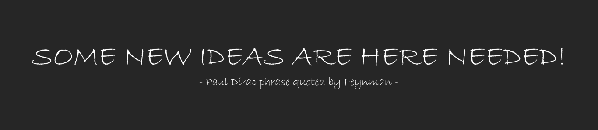

# Profile 👋

<!---->

**University** - [Incheon National University](https://www.inu.ac.kr/mbshome/mbs/inuengl/index.html)  
**Blog** - [DevSlem Blog](https://devslem.github.io/)  
**E-mail** - <devslem12@gmail.com>  
**LinkedIn** - [Jinyeong Park](https://www.linkedin.com/in/jinyeong-park-24176525a/)

Curruntly:

* study [Deep Learning by Goodfellow et al.](https://www.deeplearningbook.org/)
* wrting a paper about RL

I optimize my daily routine using **reinforcement learning** (Q-learning):

```python
# take a step
S = "busy" # state
A = "play" in { "play", "work" } # action
S' = "boom" # next state
R = -100 # penalty

# learn from an experience
Q[S,A] += alpha * (R + gamma * max(Q[S',:]) - Q[S,A])

# but, still I don't want to work...
A' = "play" # next action
```

<!--
**DevSlem/DevSlem** is a ✨ _special_ ✨ repository because its `README.md` (this file) appears on your GitHub profile.

Here are some ideas to get you started:

- 🔭 I’m currently working on ...
- 🌱 I’m currently learning ...
- 👯 I’m looking to collaborate on ...
- 🤔 I’m looking for help with ...
- 💬 Ask me about ...
- 📫 How to reach me: ...
- 😄 Pronouns: ...
- ⚡ Fun fact: ...
-->

<!--  -->  
 

### Tech Stack

<p>
 
 
 
 
 
 <br>

 
 
 
</p>

### Field

* **Reinforcement Learning (RL)** 🔥
* Machine Learning

### Project

* **Back to the Dungeon** - Unity 2D platformer shooting game
  * [Repository](https://github.com/Team-UGD/back-to-the-dungeon-scripts) - only script files
  * [Download](https://devslem.itch.io/back-to-the-dungeon)
* **AINE-DRL** - deep reinforcement learning baseline framework
  * [Repository](https://github.com/DevSlem/AINE-DRL)
  * [Download](https://pypi.org/project/aine-drl/)
* **Intrinsic Rewards for Molecular Reinforcement Learning** (working title)
  * Release Soon 🔥
